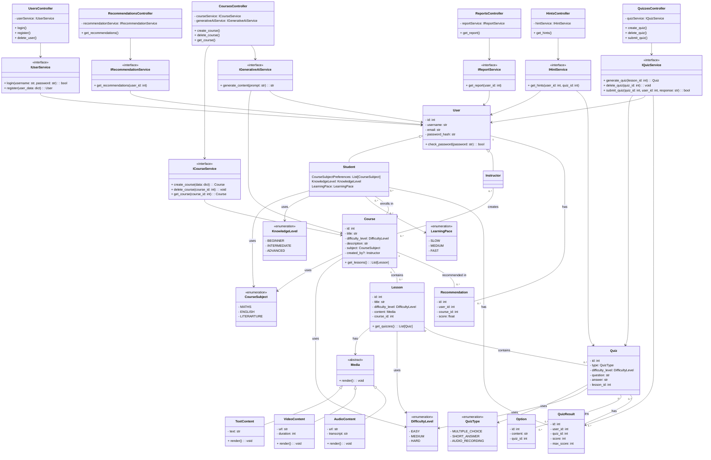

```mermaid
classDiagram
    %% Enums
    class CourseSubject {
        <<enumeration>>
        - MATHS
        - ENGLISH
        - LITERARTURE
    }

    class KnowledgeLevel {
        <<enumeration>>
        - BEGINNER
        - INTERMEDIATE
        - ADVANCED
    }

    class LearningPace {
        <<enumeration>>
        - SLOW
        - MEDIUM
        - FAST
    }

    class QuizType {
        <<enumeration>>
        - MULTIPLE_CHOICE
        - SHORT_ANSWER
        - AUDIO_RECORDING
    }

    class DifficultyLevel {
        <<enumeration>>
        - EASY
        - MEDIUM
        - HARD
    }
  
    %% Models
    class User {
        - id: int
        - username: str
        - email: str
        - password_hash: str
        + check_password(password: str): bool
    }

    class Instructor {
    }

    class Student {
        CourseSubjectPreferences: List[CourseSubject]
        KnowledgeLevel: KnowledgeLevel
        LearningPace: LearningPace
    }

    class Course {
        - id: int
        - title: str
        - difficulty_level: DifficultyLevel
        - description: str
        - subject: CourseSubject
        - created_by?: Instructor
        + get_lessons(): List[Lesson]
    }

    class Lesson {
        - id: int
        - title: str
        - difficulty_level: DifficultyLevel
        - content: Media
        - course_id: int
        + get_quizzes(): List[Quiz]
    }

    class Media {
        <<abstract>>
        + render(): void
    }

    class TextContent {
        - text: str
        + render(): void
    }

    class VideoContent {
        - url: str
        - duration: int
        + render(): void
    }

    class AudioContent {
        - url: str
        - transcript: str
        + render(): void
    }

    class Quiz {
        - id: int
        - type: QuizType
        - difficulty_level: DifficultyLevel
        - question: str
        - answer: str
        - lesson_id: int
    }

    class Option {
        - id: int
        - content: str
        - quiz_id: int
    }

    class QuizResult {
        - id: int
        - user_id: int
        - quiz_id: int
        - score: int
        - max_score: int
    }

    class Recommendation {
        - id: int
        - user_id: int
        - course_id: int
        - score: float
    }

    %% Services
    class IUserService {
        <<interface>>
        + login(username: str, password: str): bool
        + register(user_data: dict): User
    }

    class ICourseService {
        <<interface>>
        + create_course(data: dict): Course
        + delete_course(course_id: int): void
        + get_course(course_id: int): Course
    }

    class IGenerativeAiService {
        <<interface>>
        + generate_content(prompt: str): str
    }

    class IQuizService {
        <<interface>>
        + generate_quiz(lesson_id: int): Quiz
        + delete_quiz(quiz_id: int): void
        + submit_quiz(quiz_id: int, user_id: int, response: str): bool
    }

    class IRecommendationService {
        <<interface>>
        + get_recommendations(user_id: int)
    }

    class IHintService {
        <<interface>>
        + get_hints(user_id: int, quiz_id: int)
    }

    class IReportService {
        <<interface>>
        + get_report(user_id: int)
    }

    %% Controllers
    class UsersController {
        - userService: IUserService
        + login()
        + register()
        + delete_user()
    }

    class CoursesController {
        - courseService: ICourseService
        - generativeAiService: IGenerativeAiService
        + create_course()
        + delete_course()
        + get_course()
    }

    class QuizzesController {
        - quizService: IQuizService
        + create_quiz()
        + delete_quiz()
        + submit_quiz()
    }

    class RecommendationsController {
        - recommendationService: IRecommendationService
        + get_recommendations()
    }

    class HintsController {
        - hintService: IHintService
        + get_hints()
    }

    class ReportsController {
        - reportService: IReportService
        + get_report()
    }

    %% Relationships
    %% Enum Usage
    Student --> CourseSubject : uses
    Student --> KnowledgeLevel : uses
    Student --> LearningPace : uses
    Course --> CourseSubject : uses
    Lesson --> Media : has
    Quiz --> QuizType : uses
    Course --> DifficultyLevel : uses
    Lesson --> DifficultyLevel : uses
    Quiz --> DifficultyLevel : uses
    

    %% Inheritance Relationships
    User <|-- Student
    User <|-- Instructor
    Media <|-- TextContent
    Media <|-- VideoContent
    Media <|-- AudioContent

    %% Entity Relationships
    Instructor "0..*" -- "0..*" Course : creates
    Student "0..*" -- "0..*" Course : enrolls in
    Course "1" -- "0..*" Lesson : contains
    Lesson "1*" -- "0..*" Quiz : contains
    Quiz "1*" -- "0..*" Option : contains
    Quiz "0..*" -- "0..*" QuizResult : has
    Student "0..*" -- "0..*" QuizResult : has
    User "1" -- "0..*" Recommendation : has
    Course "1" -- "0..*" Recommendation : recommended in

    %% Controller-Service Relationships
    UsersController --> IUserService
    CoursesController --> ICourseService
    CoursesController --> IGenerativeAiService
    QuizzesController --> IQuizService
    RecommendationsController --> IRecommendationService
    HintsController --> IHintService
    ReportsController --> IReportService

    %% Service-Model Relationships
    IUserService --> User
    ICourseService --> Course
    IGenerativeAiService --> Course
    IGenerativeAiService --> User
    IQuizService --> Quiz
    IQuizService --> User
    IQuizService --> QuizResult
    IRecommendationService --> User
    IHintService --> User
    IHintService --> Quiz
    IReportService --> User
```
