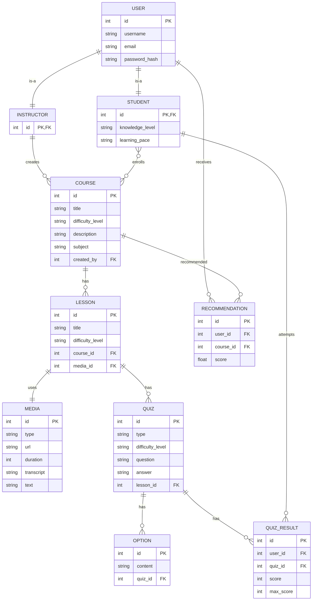

```mermaid
erDiagram
    USER {
        int id PK
        string username
        string email
        string password_hash
    }

    STUDENT {
        int id PK, FK
        string knowledge_level
        string learning_pace
    }

    INSTRUCTOR {
        int id PK, FK
    }

    COURSE {
        int id PK
        string title
        string difficulty_level
        string description
        string subject
        int created_by FK
    }

    LESSON {
        int id PK
        string title
        string difficulty_level
        int course_id FK
        int media_id FK
    }

    MEDIA {
        int id PK
        string type
        string url
        int duration
        string transcript
        string text
    }

    QUIZ {
        int id PK
        string type
        string difficulty_level
        string question
        string answer
        int lesson_id FK
    }

    OPTION {
        int id PK
        string content
        int quiz_id FK
    }

    QUIZ_RESULT {
        int id PK
        int user_id FK
        int quiz_id FK
        int score
        int max_score
    }

    RECOMMENDATION {
        int id PK
        int user_id FK
        int course_id FK
        float score
    }

    %% Entity Relationships
    %% Total disjoint specialization of USER into STUDENT and INSTRUCTOR
    USER ||--|| STUDENT : is-a
    USER ||--|| INSTRUCTOR : is-a
    %% Note: Total and Disjoint Specialization — A user must be either a student or instructor, but not both

    INSTRUCTOR ||--o{ COURSE : creates
    STUDENT }o--o{ COURSE : enrolls
    COURSE ||--o{ LESSON : has
    LESSON ||--o{ QUIZ : has
    QUIZ ||--o{ OPTION : has
    QUIZ ||--o{ QUIZ_RESULT : has
    STUDENT ||--o{ QUIZ_RESULT : attempts
    USER ||--o{ RECOMMENDATION : receives
    COURSE ||--o{ RECOMMENDATION : recommended
    LESSON ||--|| MEDIA : uses
```
